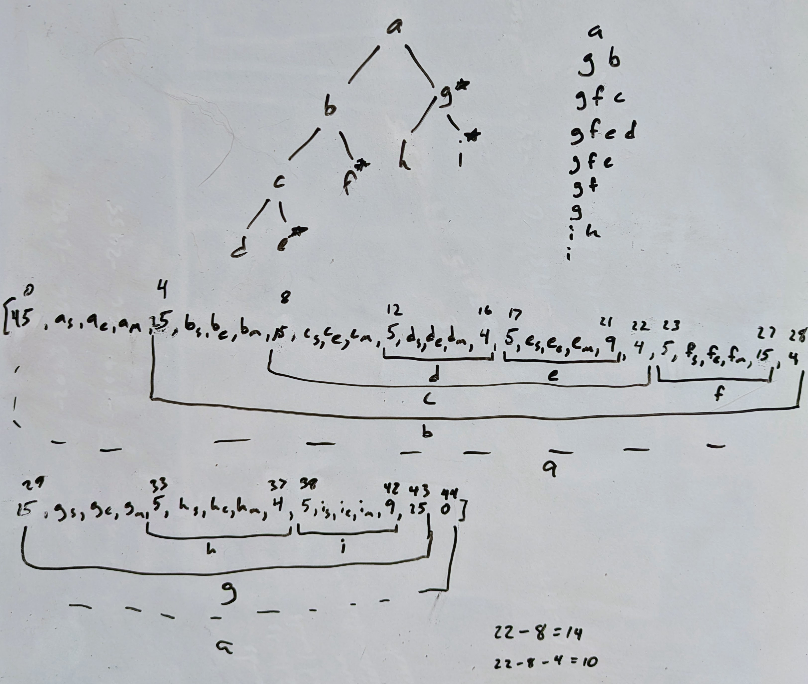

# Packed Format Design Specification

Version 1.0.0

This file documents the format used to describe a PackedTree data structure.

A packed tree is composed of two parts: an initial header containing tree
metadata (e.g. tree checksum, bounding box, etc), and the actual tree structure
in memory. 

The basic unit of the packed format is the `field`, currently defined as a
`uint32`. Thus, the entire packed tree can be considered an array of `uint32`,
and internally is stored as a numpy array of such.

# Tree Metadata

# Tree Data Structure

## Internal Node:

| skip_length | node_start | node_end | child_flag  | my_index | level | unused | C0  | C1  | C5  | C6  | C7  | parent_offset |
| ----------- | ---------- | -------- | ----------- | -------- | ----- | ------ | --- | --- | --- | --- | --- | ------------- |
| uint32      | uint32     | uint32   | uint8       | uint8    | uint8 | uint8  |     |     |     |     |     | uint32        |
| `5+sum([c.skip_length for c in children])` |     |    | CN is present if `child_flag & (2**N)=1` | Which child is this (0 if root) | What level node is this. root is 0 |        |     |     |     |     |     | `skip_length + sum([c.skip_length for c in siblings if c < self])` |
| field 0      | field 1     | field 2   | field 3      |          |       |        | *   | *   | *   | *   | *   | field 4        |

For the present case, `child_flag` would be 227 ($=2^0 + 2^1 + 2^5 + 2^6 + 2^7$). If all 5 nodes were leaves, then `skip_length`=30.
## Leaf Node:
Size = 5 fields = 20 bytes

| skip_length=20 | node_start | node_end | child_flag=0 | my_index | level | unused | parent_offset |
| -------------- | ---------- | -------- | ------------ | -------- | ----- | ------ | ------------- |
| uint32         | uint32     | uint32   | uint8        | uint8    | uint8 | uint8  | uint32        |

## Example:

Here, $x_{s}$, $x_{e}$, and $x_{m}$ are the node_start, node_end, and metadata (child_flag, my_index, level, and empty) fields for node $x$. The starred nodes in the tree are the last sibling for each group of children.
