# Benchmarking `packingcubes`
## Setup
We use the code in `benchmarks/performance` to run our benchmarks. It's similar
in functionality to the `timeit` module (which it was based on), with further
customization.

For each search object, we construct a dataset of size $n$ with random data and
pass it to the creation method. Psuedocode:
```python
dataset = InMemory(positions=random_positions)
for name, creation_method in creation_dict.items():
    search_objects[name], bench[name] = benchmark(
        creation_method,
        dataset.copy()
    )
```
Since the `packingcubes` versions actually sort the data, we reset the dataset
before each timing run. This is excluded from the results.

We then generate a number of random spheres (10 for now) that overlap the
dataset (they do not need to be entirely contained). These are our "search 
balls" and we set their radii such that $\sim m$ particles are contained:
```python
for i in range(10):
    centers[i] = random_point_in_dataset(dataset)
    radii[i], actual_numbers[i] = smallest_radii_containing_points(dataset, center, m)
```

Finally, for every search method, we average the time taken to search over all
search balls:
```python
for name, (so_name, search_method) in search_dict.items():
    search_results, bench[name] = benchmark(
        search_objects[so_name].search_method, 
        (centers, radii)
    )
    if can_verify(search_method):
        verify_search(search_results, actual_numbers)
```
We do the equivalent for `query` type methods, except we use 100 particles.

For some of the search methods (anywhere a strict search is available), we
verify that we return the correct number of particles as well.


We benchmark across the following dataset sizes and search ball sizes:

| **$m \\ n$** | $10^{4}$ | $10^{5}$ | $10^{6}$ | $10^{7}$ | $10^{8}$ |
| -------- | -------- | -------- | -------- | -------- | -------- |
| $10^{3}$ | &#9745; | &#9745; | &#9745; | &#9745; | &#9745; |
| $10^{4}$ | &#9745;[^1] | &#9745; | &#9745; | &#9745; | &#9745; |
| $10^{5}$ | &#9745;[^1] | &#9745;[^1] | &#9745; | &#9745; | &#9745; |

[^1]: For these cases, the search result should include the *entire* 
dataset. This is *trivially* easy to do with `PackedTrees` (it's effectively
just `np.arange(len(ds))`). It's slightly more complicated for `ParticleCubes`,
since you need to append multiple cubes, but there's still no tree traversal.
This explains the extremely small results for those cases.


We benchmark the following functions:

<div class="grid cards" markdown>
    
- **Creation** 
    
    | Search Object (Library) |
    | --------------------------------------- |
    | PackedTree |
    | Cubes |
    | OpTree | 
    | KDTree (SciPy) |

- **Search**

    | Name | Search Object | Function/Method |
    | ---- | ------------- | --------------- | 
    | packed-search | PackedTree |`get_particle_indices_in_sphere`|
    | packli-search[^2] | PackedTree | `get_particle_index_list_in_sphere`   |
    | packnumb-search[^2] | PackedTree |`get_particle_indices_in_sphere`[^3] |
    | cubes-search[^2] | ParticleCubes | `get_particle_indices_in_sphere` |
    | cubeli-search | ParticleCubes | `get_particle_index_list_in_sphere` |
    | optree-search | OpTree | `query_ball_point` |
    | kdtree-search[^4] | KDTree | `query_ball_point` |

- **Query**

    | Name | Search Object | Function/Method |
    | ---- | ------------- | --------------- |
    | Optree | Optree | `query` |
    | KDTree | KDTree | `query` |
  
</div>

[^2]: Used in regression testing only
[^3]: Called from within another jitted function 
[^4]: Used in comparison benchmarking only

## Results
### Raw Timing
Here we show the raw timing results. For all benchmarks, we do an untimed
trial run first, to sort out any precompiling/warmup.
<div class="grid cards" markdown>
    
- **Creation**
  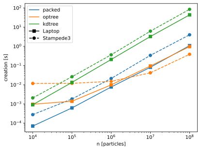

- **Search**
  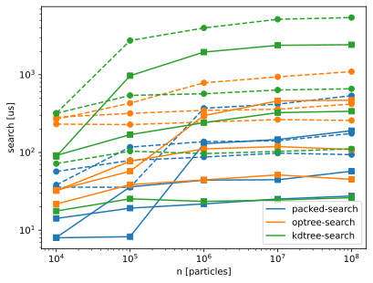

- **Query**
  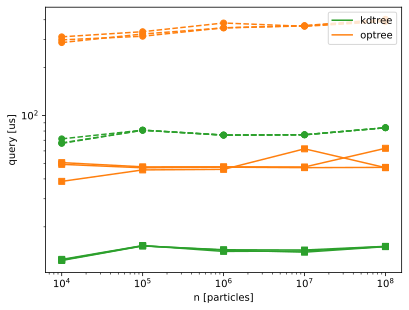

</div>

### Expected Scaling
Here we show the timing for the various tasks divided by the expected growth
rate, normalized at $n=10^6$.

Consider, for example, tree creation, which involves (and is dominated by) a
sorting of the data. Sorting is classically an $O(n\log n)$ process, and, if
we normalize and divide out $n\log n$, we would expect a flat line. We can see
this behavior in the first panel for the `PackedTree`. The `KDTree` does a
little worse than $n \log n$ (the slight upwards trend); `Cubes` does slightly better[^5].

[^5]: This is much more likely due more to the normalization and/or 
parallelization then because we've achieved an improvement over general search.

<div class="grid cards" markdown>
    
- **Creation**
  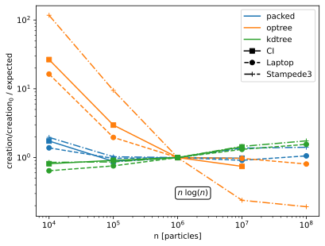

- **Search**
  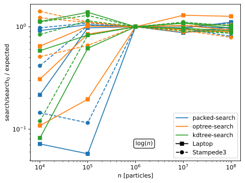

- **Query**
  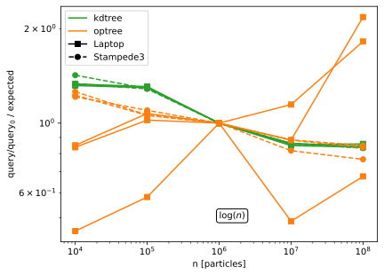

</div>

### VS SciPy
Here we normalize to the SciPy results from KDTree.
<div class="grid cards" markdown>
    
- **Creation**
  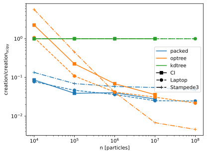

- **Search**
  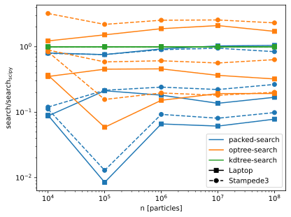

- **Query**
  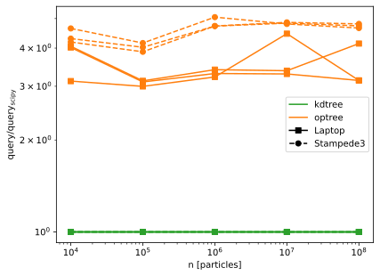

</div>

### Latest CI Run
In the following images, we show the latest CI run only, highlighting the most
up-to-date performance:

<div class="grid cards" markdown>
    
- **Creation times**
  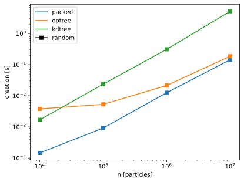

- **Search times**
  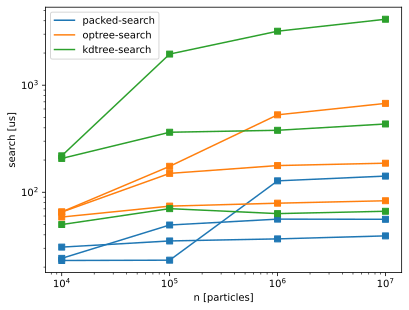

- **Query times**
  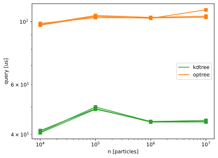
</div>


<script id="MathJax-script" src="https://unpkg.com/mathjax@3/es5/tex-mml-chtml.js"></script>
<script>
  window.MathJax = {
    tex: {
      inlineMath: [["\\(", "\\)"]],
      displayMath: [["\\[", "\\]"]],
      processEscapes: true,
      processEnvironments: true
    },
    options: {
      ignoreHtmlClass: ".*|",
      processHtmlClass: "arithmatex"
    }
  };

  document$.subscribe(() => {
    MathJax.startup.output.clearCache()
    MathJax.typesetClear()
    MathJax.texReset()
    MathJax.typesetPromise()
  })
</script>
