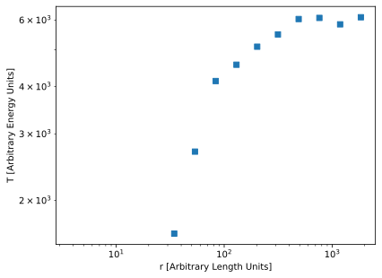

# Temperature vs Radii of a Halo - Direct Search

In this recipe, we'll be retrieving the temperature of the gas particles in a
halo in an IllustrisTNG dataset and plotting them as a function of radius.

We'll do this using search indices directly here;
for a similar recipe where we use Search Objects, see 
[:lucide-chart-line: Temperature vs Radii of a Halo - Search Objects](TempVsRadii_SearchObj).

## Snapshot information
We will be using 
[snapshot_090.hdf5](https://users.flatironinstitute.org/~camels/Sims/IllustrisTNG/L25n256/CV/CV_3/snapshot_090.hdf5)
(about $10^7$ particles, 2.5 GB) from one of the IllustrisTNG runs used in the
[CAMELS](https://camels.readthedocs.io/en/latest/index.html) project for this
recipe. The halo information we're using is obtained from the `groups_090.hdf5`
file at the same location.

Since this is simply for demonstration purposes, we'll look at the most massive
halo in the box (ID: 0). This halo has a center of mass at $(18271, 5533, 5246)$ 
and a $R_{c,200}$ of $745$. (We'll assume arbitrary units, round values and a
spherical halo).

## Import packages
```python
import numpy as np
import matplotlib.pyplot as plt
import packingcubes
```

## Load Temperatures

Temperature isn't directly stored. Instead, we use 
$$
\gamma = \frac{5}{3}, \qquad x_H = 0.76, 
$$
$$
\mu = \frac{4}{1 + 3 x_H + 4 x_H a_e} ,
$$
$$
T = \mu (\gamma-1) U,
$$
assuming $m_p=k_B=1$, $a_e$ is the electron abundance (as 
`PartType0/ElectronAbundance`) and $U$ is the internal energy
(as `PartType0/InternalEnergy`).

### Load Dataset
```python
dataset = packingcubes.GadgetishHDF5Dataset(
    filepath="snapshot_090.hdf5",
    particle_type="PartType0",
)
```

### Cube
```python
cubes = packingcubes.Cubes(dataset)
```

### Create Temperatures data
From above, we need the extra fields `ElectronAbundance` and `InternalEnergy`.
```python
dataset.process_extra_fields(
    {
        "e_abun":"ElectronAbundance",
        "u":"InternalEnergy",
    }
)
```

Compute temperature:
```python
gamma = 5/3
x_H = 0.76
mu = 4/(1 + 3*x_H + 4*x_H*dataset.e_abun)
T = mu * (gamma-1) * dataset.u
```

Add temperature to dataset:
```python
dataset.process_extra_fields({"T":(T, True)}) # (1)!
```

1. We need to specify that T is already sorted since $\mu$ and $U$ are

??? note
    We could have also done this calculation after the search, using subindices
    of `e_abun` and `u`, but this is just as easy, and this way we can easily get
    the temperature of particles in other regions.

## Get Halo Particle Temperature and Radii
Extract the temperature of all particles in our halo[^1].

[^1]: Technically, this will include particles in subhalos and unbound
    particles. But that's totally fine for this plot.

### Create Sphere
Define our search region as the sphere enclosing the halo:
```python
center = [18271, 5533, 5246]
radius = 745 * 2
```

### Search
```python
chunks = cubes.get_particle_indices_in_sphere(center, radius)

num_found = np.sum(chunks[:,1]-chunks[:,0])
```

### Get Radii/Temperature

#### Get positions from chunk
```python
positions = np.empty_like(dataset.positions, shape=(num_found, 3))

offset = 0
for chunk in chunks:
    size = chunk[1] - chunk[0]
    positions[offset:offset + size, :] = dataset.positions[chunk[0]:chunk[1], :]
    offset += size
```

#### Compute radii
```python
radii = np.sqrt(np.sum((positions - center)**2, axis=1))
```

#### Get Temperatures
```python
T = np.empty_like(dataset.T, shape=(num_found, )) # (1)!

offset = 0
for chunk in chunks:
    size = chunk[1] - chunk[0]
    T[offset:offset + size] = dataset.T[chunk[0]:chunk[1]]
    offset += size
```

1. Note that we're overwriting our `T` definition from earlier, since we've
   attached it to the dataset.

## Plot

The following is a quick and dirty method for computing the average temperature
per radial bin and is not really part of the recipe. Consider using a more robust
method.

```python
logradii = np.log10(radii)
num_bins = 15
bins = np.histogram_bin_edges(logradii, bins=num_bins)
bindices = np.digitize(logradii, bins=bins)
Tbins = np.empty_like(T, shape=(num_bins,))

for i in range(num_bins):
    match = T[bindices==i]
    Tbins[i] = np.mean(match) if match.size>100 else 0

bin_centers = 10**(bins[:-1] + np.diff(bins)/2)

plt.loglog(bin_centers, Tbins, 's')
plt.xlabel("r [Arbitrary Length Units]")
plt.ylabel("T [Arbitrary Energy Units]")
plt.savefig("figures/TVR_direct.svg", bbox_inches="tight")
```



<script id="MathJax-script" src="https://unpkg.com/mathjax@3/es5/tex-mml-chtml.js"></script>
<script>
  window.MathJax = {
    tex: {
      inlineMath: [["\\(", "\\)"]],
      displayMath: [["\\[", "\\]"]],
      processEscapes: true,
      processEnvironments: true
    },
    options: {
      ignoreHtmlClass: ".*|",
      processHtmlClass: "arithmatex"
    }
  };

  document$.subscribe(() => {
    MathJax.startup.output.clearCache()
    MathJax.typesetClear()
    MathJax.texReset()
    MathJax.typesetPromise()
  })
</script>

