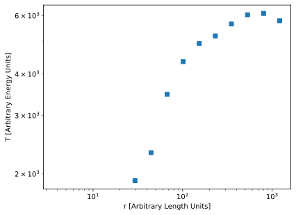

# Temperature vs Radii of a Halo - SearchObjects

In this recipe, we'll be retrieving the temperature of the gas particles in a
halo in an IllustrisTNG dataset and plotting them as a function of radius.

We'll do this using Search Objects here;
for a similar recipe where we use indices directly, see 
[:lucide-chart-line: Temperature vs Radii of a Halo - Direct Search](TempVsRadii_Direct).

## Snapshot information
We will be using 
[snapshot_090.hdf5](https://users.flatironinstitute.org/~camels/Sims/IllustrisTNG/L25n256/CV/CV_3/snapshot_090.hdf5)
(about $10^7$ particles, 2.5 GB) from one of the IllustrisTNG runs used in the
[CAMELS](https://camels.readthedocs.io/en/latest/index.html) project for this
recipe. The halo information we're using is obtained from the `groups_090.hdf5`
file at the same location.

Since this is simply for demonstration purposes, we'll look at the most massive
halo in the box (ID: 0). This halo has a center of mass at $(18271, 5533, 5246)$ 
and a $R_{c,200}$ of $745$. (We'll assume arbitrary units, round values and a
spherical halo).

## Import packages
```python
import numpy as np
import matplotlib.pyplot as plt
import packingcubes
```

## Create Search Object

### Temperature Definition

Temperature isn't directly stored. Instead, we use 
$$
\gamma = \frac{5}{3}, \qquad x_H = 0.76, 
$$
$$
\mu = \frac{4}{1 + 3 x_H + 4 x_H a_e} ,
$$
$$
T = \mu (\gamma-1) U,
$$
assuming $m_p=k_B=1$, $a_e$ is the electron abundance (as 
`PartType0/ElectronAbundance`) and $U$ is the internal energy
(as `PartType0/InternalEnergy`).

### Cube Data
We'll use the [All-in-One](../Tutorials/Working_with_datasets#all-in-one)
method of combining the dataset loading and cubes creation.

```python
cubes = packingcubes.Cubes(
    "snapshot_090.hdf5",
    particle_type="PartType0",
    extras={
        "e_abun":"ElectronAbundance",
        "u":"InternalEnergy",
    }
)
```

### Compute temperature
```python
gamma = 5/3
x_H = 0.76
mu = 4/(1 + 3*x_H + 4*x_H * cubes.dataset.e_abun)
T = mu * (gamma-1) * cubes.dataset.u
```

??? note
    We could have also done this calculation after the search, using the
    `e_abun` and `u` properties of the search object, but this is just as easy,
    and this way we can easily get the temperature of particles in other regions.
    
### Create Search Object
#### Create Sphere
Define our search region as the sphere enclosing the halo:
```python
center = [18271, 5533, 5246]
radius = 745 * 2
```

#### Search
We'll include our new temperature field when creating the search object.
It'll still be added to the dataset as if we had used 
`dataset.process_extra_fields()`. We'll also specify a strict search, to get
slightly different results from the [Direct Search](TempVsRadii_Direct) recipe.

```python
sphere = cubes.Sphere(
    center, radius,
    strict=True,
    extras = {"T":(T, True)} # (1)!
) #(2)!
```

1. We need to specify that T is already sorted since $\mu$ and $U$ are
2. If we only needed fields that were already present (and sorted!), like
   `InternalEnergy`, we could have passed `fields=["InternalEnergy", ...]`
   instead of `extras`.


## Get Halo Particle Temperature and Radii
Extract the temperature of all particles in our halo[^1].

[^1]: Technically, this will include particles in subhalos and unbound
    particles. But that's totally fine for this plot.

#### Compute radii
```python
radii = np.sqrt(np.sum((sphere.positions - center)**2, axis=1))
```

## Plot

The following is a quick and dirty method for computing the average temperature
per radial bin and is not really part of the recipe. Consider using a more robust
method.

```python
logradii = np.log10(radii)
num_bins = 15
bins = np.histogram_bin_edges(logradii, bins=num_bins)
bindices = np.digitize(logradii, bins=bins)
Tbins = np.empty_like(sphere.T, shape=(num_bins,))

for i in range(num_bins):
    match = sphere.T[bindices==i]
    Tbins[i] = np.mean(match) if match.size>100 else 0

bin_centers = 10**(bins[:-1] + np.diff(bins)/2)

plt.loglog(bin_centers, Tbins, 's')
plt.xlabel("r [Arbitrary Length Units]")
plt.ylabel("T [Arbitrary Energy Units]")
plt.savefig("figures/TVR_search.svg", bbox_inches="tight")
```



<script id="MathJax-script" src="https://unpkg.com/mathjax@3/es5/tex-mml-chtml.js"></script>
<script>
  window.MathJax = {
    tex: {
      inlineMath: [["\\(", "\\)"]],
      displayMath: [["\\[", "\\]"]],
      processEscapes: true,
      processEnvironments: true
    },
    options: {
      ignoreHtmlClass: ".*|",
      processHtmlClass: "arithmatex"
    }
  };

  document$.subscribe(() => {
    MathJax.startup.output.clearCache()
    MathJax.typesetClear()
    MathJax.texReset()
    MathJax.typesetPromise()
  })
</script>


