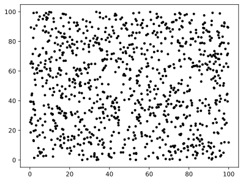
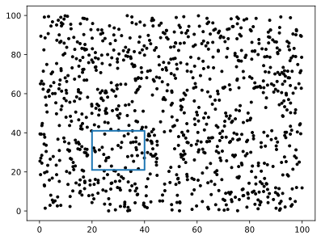
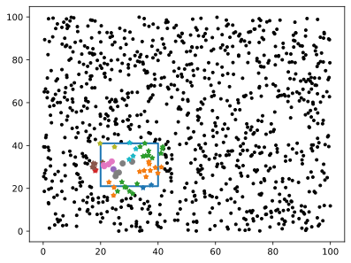
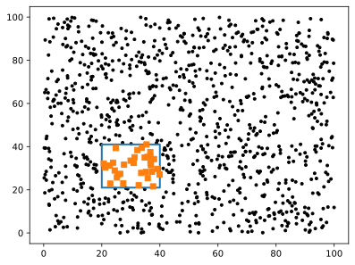
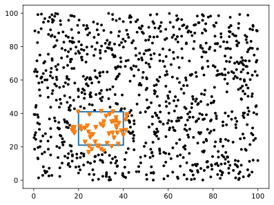
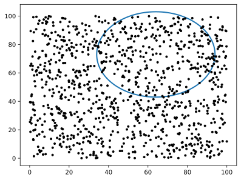
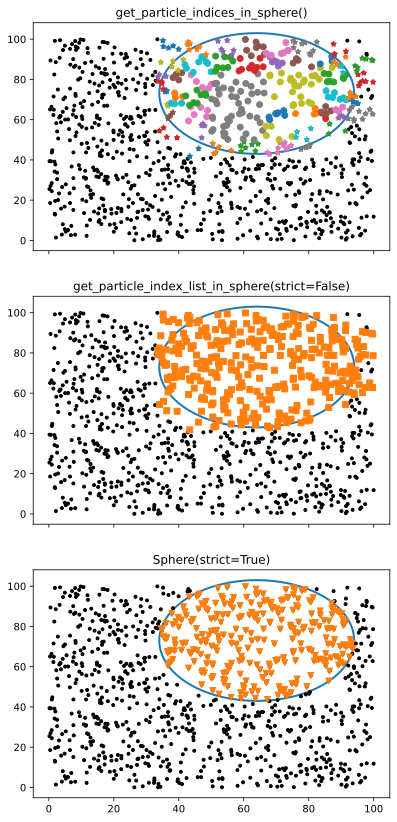

# Finding Particles Within a Shape


We have 4 goals for this tutorial:

1. Create some particle position data
2. Create a `ParticleCubes` object
3. Find all the particles in a square
4. Find all the particles within a circle

We'll assume you already are somewhat familiar with `numpy` and `matplotlib`.

We'll keep everything in 2D to make plotting easier, but all of these steps 
can be done in 1D & 3D as well[^1].  

[^1]: The `packingcubes` portions are actually much simpler in 3D, as will 
    become obvious shortly, but the plotting becomes a lot harder.

??? info "Code cells and the terminal"
    The code cells in this tutorial are intended for use in/copying to python
    notebook (`.ipynb`) or ipython inputs and so have many plot commands that
    would be unnecessary or require `plt.show()` constantly for someone 
    experimenting from e.g. the terminal. If you are such a user, we'll denote
    a cell with plot commands that you may want to use like so:

    ``` python
    plt.plot(...) # (1)!
    ```

    1. Run `plt.show()` after these commands

    And any cell that does not have such an annotation you can ignore all lines
    starting with `plt`.


## Install and Import Dependencies


Since we'll be using `matplotlib` for visualization, we'll want to include the
`viz` optional dependencies:

=== "pip"
    ``` bash
    $ pip install "packingcubes[viz]
    ```

=== "pixi"
    ``` bash
    $ pixi add packingcubes[viz] --pypi
    ```


Now import the modules we need

```python
import numpy as np
import matplotlib.pyplot as plt

import packingcubes
```

## Create positions data


We'll start by generating some random data. We'll make 1000 particles with $x$ and $y$
coordinates ranging from 0 to 100.

```python
xy = np.random.uniform(size=(1000,2)) * 100

plt.plot(xy[:,0], xy[:,1] , "k.")
plt.savefig("PWS_figs/fig_1.svg", bbox_inches="tight") # (1)!
```

1. You can ignore lines, they're temporary fixes for issues rendering images in the docs



ParticleCubes are designed to work with 3D data, so we'll need to pad our 2D
data with zeros to make it 3D.

```python
positions = np.zeros_like(xy, shape=(len(xy),3))
positions[:, :2] = xy
```

??? tip "1D/2D data and OpTrees"
    [OpTrees](../Reference/Packed-Trees#Optree) will do this padding for you
    at the cost of being a little more opaque, and *only* working with position
    data. Note that `packingcubes` will be 4x/2x slower creating the tree than
    a dedicated binary- or quad-tree would be. Search should still be
    comparable, however.

## Create a ParticleCubes object


We don't need anything fancy, so creating a `ParticleCubes` is pretty simple:

```python
cubes = packingcubes.Cubes(positions, particle_threshold=10) # (1)!
cubes
```

1. You normally wouldn't specify the `#!python particle_threshold`. It's only done here
   to create multiple data chunks for the plots.

## Find all particles in a square


### Define our square


We'll look at the square whose bottom-left corner is $(20, 21)$ and that has a side-length of 10.

```python
plt.plot(xy[:,0], xy[:,1] , "k.")
bx = 20
by = 21
side = 20
plt.plot(bx + np.array([0, side, side, 0, 0]), by + np.array([0, 0, side, side, 0]), lw=2)
plt.savefig("PWS_figs/fig_2.svg", bbox_inches="tight")
```



To search in a box, we set the corner position and then the dimensions of the
box as a single array in the form `[x, y, z, dx, dy, dz]`.

Unfortunately, `ParticleCubes` do not currently support 1D or 2D search shapes.
Luckily, making our square 3D is easy, just set the $z$ position to 0:

```python
box = [bx, by, 0, side, side, side] # (1)!
```

1. Having a 3D search volume with 2D data is fine, `packingcubes` will effectively
just ignore the third dimension. The only caveat is you need to ensure the box 
actually has a volume. Setting `dz=0` would raise an error.


### Actually do the search

We'll do the search in 3 different ways, corresponding to different use-cases:

#### Chunk indices

```python
index_array = cubes.get_particle_indices_in_box(box)
```

Index array is an array of data chunk indices, where each row represents a
data chunk in the form `[start, stop, partial]`. `partial` just specifies if
the entire chunk is contained (`0`) or if it's only _partially_ contained (`1`).

```python
plt.plot(xy[:,0], xy[:,1] , "k.") # (1)!
plt.plot(bx + np.array([0, side, side, 0, 0]), by + np.array([0, 0, side, side, 0]), lw=2)

for start, stop, partial in index_array:
    # plot each chunk of data
    chunk = positions[start:stop, :2]
    plt.plot(chunk[:,0], chunk[:, 1], "*" if partial else "o") # (2)!
plt.savefig("PWS_figs/fig_3.svg", bbox_inches="tight")
```

1. Run `plt.show()` after these commands
2. Using different markers for the different `partial` values is purely for
   visual effect, there's no difference between the chunks.
   


??? success "Best for high performance"
    This method will give results in the shortest possible time (since there's
    no sorting or strict containment checks) and is intended for loading data
    from files. It also does not require any information from the dataset,
    everything needed is already included in the cubes structure, and so uses
    the least amount of memory.

#### Index lists

```python
index_list = cubes.get_particle_index_list_in_box(box, strict=True)
```

Array of indices into the positions array. With this method, you can specify
whether particles must *strictly* be inside the box (shown), or if you want
the indices in the original unsorted data (`use_data_indices=False`, not shown).

```python
plt.plot(xy[:,0], xy[:,1] , "k.") # (1)!
plt.plot(bx + np.array([0, side, side, 0, 0]), by + np.array([0, 0, side, side, 0]), lw=2)

plt.plot(positions[index_list,0], positions[index_list, 1], "s")
plt.savefig("PWS_figs/fig_4.svg", bbox_inches="tight")
```

1. Run `plt.show()` after these commands



??? success "Best for parity with SciPy's KDTree"
    These results will be the most similar to SciPy's KDTree output, but note
    that it's almost always more performant to use index slices, like in chunk
    indices, than actual indexes, especially if you expect many of them. This
    method requires access to the dataset (usually already included).

#### Search Objects
(name WIP, suggestions welcome!)

```python
search_positions = cubes.Box(box, strict=False).positions # (1)!
```

1. You can get the same strictness check as with index lists by setting
  `strict=True`

This will return the actual positions of the particles in the box. Note that you
can't get the direct particle indices in this fashion, but you can obtain other
fields besides positions via this method[^2]. See 
[:lucide-chart-line: Temperature vs Radii of a Halo using Search Objects](../Recipes/TempVsRadii_SearchObj)
for an example.

```python
plt.plot(xy[:,0], xy[:,1] , "k.") # (1)!
plt.plot(bx + np.array([0, side, side, 0, 0]), by + np.array([0, 0, side, side, 0]), lw=2)

plt.plot(search_positions[:,0], search_positions[:, 1], "v")
plt.savefig("PWS_figs/fig_5.svg", bbox_inches="tight")
```

1. Run `plt.show()` after these commands



??? success "Best for looking at multiple fields of the particles"
    This method will give you a subdataset with all the extra fields you
    request. You can also request strict containment checks. This method requires
    access to the positions and any extra fields defined, and can use a lot 
    more memory.

## Find all particles in a circle


### Define the circle


We'll look at the circle centered at $(64, 73)$ with radius $30$. 

Note that this circle extends outside our data bounds!

We'll need to do the same `z=0` trick when converting to a 3D sphere.

```python
center = [64, 73, 0]
radius = 30
```

```python
plt.plot(xy[:,0], xy[:,1] , "k.")
circle = plt.Circle(
    center[:2], radius, color='tab:blue', 
    lw=2, clip_on=False, fill=False
)
plt.gca().add_patch(circle)
plt.savefig("PWS_figs/fig_6.svg", bbox_inches="tight")
```



### Actually do the search


This works pretty much identically to the square (box), so we'll do all three types at once:

```python
index_array = cubes.get_particle_indices_in_sphere(center=center, radius=radius)
index_list = cubes.get_particle_index_list_in_sphere(
    center=center, radius=radius, strict=False
) # (1)!
search_positions = cubes.Sphere(
    center=center, radius=radius, strict=True
).positions
```

1. We've swapped the strictness tests for demonstration purposes

```python
fig, axs = plt.subplots(3,1, sharey=True, sharex=True) # (1)!
fig.set_figheight(14)
for ax in axs:
    ax.plot(xy[:,0], xy[:,1] , "k.")
    circle = plt.Circle(
        center[:2], radius, color='tab:blue',
        lw=2, clip_on=False, fill=False
    )
    ax.add_patch(circle)

# plot index_array
for start, stop, partial in index_array:
    # plot each chunk of data
    chunk = positions[start:stop, :2]
    axs[0].plot(chunk[:,0], chunk[:, 1], "*" if partial else "o") # (2)!
axs[0].set_title("get_particle_indices_in_sphere()")

# plot index_list
axs[1].plot(
    positions[index_list,0], positions[index_list, 1],
    "s",color="tab:orange"
)
axs[1].set_title("get_particle_index_list_in_sphere(strict=False)")

# plot Sphere
axs[2].plot(
    search_positions[:,0], search_positions[:, 1],
    "v", color="tab:orange"
)
axs[2].set_title("Sphere(strict=True)")

plt.savefig("PWS_figs/fig_7.svg", bbox_inches="tight")
```

1. Run `plt.show()` after these commands
2. Just like above, using different markers for the different `partial` values
   is purely for visual effect, there's no difference between the chunks.



!!! warning "Fragile Data!"
    You may notice that the order of the data in `positions` has changed (occurred
    when we made `cubes`). This is by design! But it also means if you modify 
    `positions` you will break the linkage between search results and the data.
    For more on this, see [:lucide-grid-3x2: Working with Datasets](Working_with_datasets)
    for more robust ways to interact with data.

## Summary
Below is a table of the different methods used here as well as some notes:

| Desired result... | in a Box. | in a Sphere. | Notes |
| ----------------- | --------- | ------------ | ----- |
| particle index chunks as fast as possible| `get_particle_indices_in_box(box)` | `get_particle_indices_in_sphere(center, radius)` | Minimal memory use, fastest performance, need to process index chunks |
| actual particle indices | `get_particle_index_list_in_box(box)` | `get_particle_index_list_in_sphere(center, radius)` | Closest to SciPy's KDTree, can do strict containment tests. How often do you actually need the particle indices? |
| Multiple data fields in a region | `Box(box)` | `Sphere(center, radius)` | Returns a subdataset, with fields available as `.field_name`. Requires some additional setup[^2][^3]. Grabs every field specified, potentially taking more time, memory, but is reusable. |

[^2]: See [Sorting Additional Fields](Working_with_datasets#sorting-additional-fields)
    and  [All-in-One](Working_with_datasets#all-in-one) for
    how to specify them.

[^3]: See 
    [:lucide-chart-line: Temperature vs Radii of a Halo using Search Objects](../Recipes/TempVsRadii_SearchObj)
    for an example of the additional setup.

<script id="MathJax-script" src="https://unpkg.com/mathjax@3/es5/tex-mml-chtml.js"></script>
<script>
  window.MathJax = {
    tex: {
      inlineMath: [["\\(", "\\)"]],
      displayMath: [["\\[", "\\]"]],
      processEscapes: true,
      processEnvironments: true
    },
    options: {
      ignoreHtmlClass: ".*|",
      processHtmlClass: "arithmatex"
    }
  };

  document$.subscribe(() => {
    MathJax.startup.output.clearCache()
    MathJax.typesetClear()
    MathJax.texReset()
    MathJax.typesetPromise()
  })
</script>
